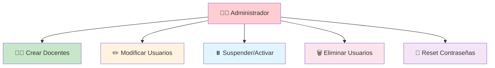

# 👥 **ROLES DEL SISTEMA E-VALUACION**

---

## 🎯 **DESCRIPCIÓN GENERAL**

> [!NOTE]
> 📚 El sistema e-VALuacion cuenta con **dos roles principales** que definen los niveles de acceso y funcionalidades disponibles para cada tipo de usuario.

---

# 👨‍🏫 **ROL DOCENTE**

## 📋 **Descripción**

> [!IMPORTANT]
> 🎓 El **docente** es el usuario principal del sistema que utiliza la herramienta para evaluar a sus estudiantes mediante **rúbricas personalizadas**.

---

## 🛠️ **PERMISOS Y FUNCIONALIDADES**

<table>
<tr>
<td width="50%">

### 📊 **Gestión de Rúbricas**

- [x] ✨ **Crear** nuevas rúbricas de evaluación
- [x] ✏️ **Modificar** rúbricas existentes propias  
- [x] 📋 **Duplicar** rúbricas para reutilización
- [x] 🗑️ **Eliminar** rúbricas propias
- [x] 👁️ **Ver** rúbricas públicas de otros docentes

</td>
<td width="50%">

### 📝 **Gestión de Evaluaciones**

- [x] 🎯 **Crear** evaluaciones basadas en rúbricas
- [x] 👥 **Asignar** evaluaciones a grupos
- [x] ⭐ **Calificar** trabajos usando rúbricas
- [x] 📊 **Generar** reportes de calificaciones
- [x] 📄 **Exportar** resultados (PDF/Excel)

</td>
</tr>
</table>

👨‍🎓 <strong>Gestión de Estudiantes</strong>

### 👨‍🎓 **Gestión de Estudiantes**

| Funcionalidad | Estado | Descripción |
|---------------|:------:|-------------|
| 📝 Crear listas | ✅ | Crear y gestionar listas de estudiantes |
| 🏷️ Organizar grupos | ✅ | Organizar estudiantes por grupos/cursos |
| 📈 Ver historial | ✅ | Ver historial de evaluaciones por estudiante |
| 💬 Retroalimentación | ✅ | Enviar retroalimentación personalizada |

⚙️ <strong>Configuración Personal</strong>

### ⚙️ **Configuración Personal**

- 👤 **Actualizar** información de perfil
- 🔒 **Cambiar** contraseña
- 📧 **Configurar** notificaciones por email  
- 🎨 **Personalizar** interfaz de usuario

---

# 👨‍💼 **ROL ADMINISTRADOR**

## 📋 **Descripción**

> [!CAUTION]
> 🔧 El **administrador** es responsable de la **gestión general** del sistema, mantenimiento de usuarios y configuración global de la plataforma.

---

## 🛡️ **PERMISOS Y FUNCIONALIDADES**

### 👥 **Gestión de Usuarios**

| Acción | Icono | Descripción | Nivel de Acceso |
|--------|:-----:|-------------|:---------------:|
| **Crear cuentas** | ➕ | Crear cuentas de docentes | 🔴 Alto |
| **Modificar info** | ✏️ | Modificar información de usuarios | 🟡 Medio |
| **Suspender/Activar** | ⏸️/▶️ | Suspender/activar cuentas | 🔴 Alto |
| **Eliminar usuarios** | 🗑️ | Eliminar usuarios del sistema | 🔴 Alto |
| **Reset contraseñas** | 🔑 | Resetear contraseñas de usuarios | 🟡 Medio |

---

### ⚙️ **Gestión del Sistema**

| **Funcionalidad** | **Estado** | **Prioridad** |
|:-----------------:|:----------:|:-------------:|
| 🔧 Parámetros globales | 🟢 Activo | 🔴 Alta |
| 💾 Copias de seguridad | 🟢 Activo | 🔴 Alta |
| 📊 Monitoreo rendimiento | 🟡 Parcial | 🟡 Media |
| 🔄 Actualizaciones | 🟢 Activo | 🟡 Media |
| 💽 Gestión almacenamiento | 🟢 Activo | 🔴 Alta |

---

### 📊 **Supervisión y Reportes**

> [!TIP]
> 📈 El administrador tiene acceso completo a **métricas** y **análisis** del sistema

<table>
<tr>
<td width="33%">

#### 📈 **Estadísticas**
- 📊 Ver estadísticas de uso
- 👥 Usuarios activos
- 📝 Evaluaciones realizadas
- 💾 Uso de almacenamiento

</td>
<td width="33%">

#### 📋 **Reportes**
- 📊 Generar reportes de actividad
- 🔍 Auditar acciones de usuarios
- 📈 Análisis de rendimiento
- 📅 Reportes programados

</td>
<td width="34%">

#### 🔍 **Monitoreo**
- ⚠️ Monitorear errores
- 🐛 Problemas técnicos
- 📜 Acceder a logs del sistema
- 🚨 Alertas automáticas

</td>
</tr>
</table>

---

## 🎯 **RESUMEN DE ROLES**

| Rol | Usuarios | Evaluaciones | Sistema | Reportes |
|:---:|:--------:|:------------:|:-------:|:--------:|
| 👨‍🏫 **Docente** | ❌ | ✅ | ❌ | 📊 Básicos |
| 👨‍💼 **Admin** | ✅ | ✅ | ✅ | 📊 Completos |

---

**📝 Documentado por Equipo 4** | **📅 Junio 2025** | **🎯 Proyecto e-VALuacion**

